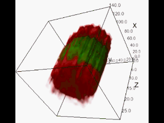

# Clog-Loss-Advance-Alzheimer-s-Research
Competition link : [click here!](https://www.drivendata.org/competitions/65/clog-loss-alzheimers-research/)

It has online data set in the amazon server. All videos are hosted in a public s3 bucket called "drivendata-competition-clog-loss".
The full training dataset contains over 570,000 videos, which is around 1.4 terabytes!
The target vessel segment for each video is outlined in orange. The first notebook download a video and then extract the contents of inside the orange area.
The extracted area in the video converted to a 3d tensor then it will compresed and stored in the local memory.\
Data_Downloader [Script](./script/prepare_dataset.py) [It is **Multiprocessing script**] - [Notbook](./notebook/01_dataset_analysis.ipynb)\
- Video will be downloaded from the server: \
  
- Outlined area will be detected: \
  
- Cropped Video is conveted to a tensor: \
 

# **3D-CNN-LSTM classifier Model**: 
This model contains 3D-EfficientNet as a feature detection and feature will be passed through a LSTM network to learn relation of between video frame sequence and a fully connected layer is attached on top of that to calssify the flowing or cloged vessels.

 
